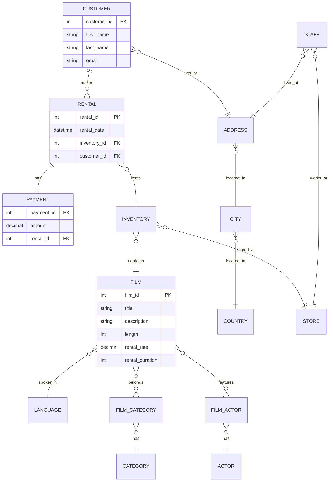

# Sakila Database Analysis Lab

**Författare:** Henrik Göransson  
**Kurs:** SQL och Relationsdatabaser  
**Databas:** Sakila DVD-uthyrningsdatabas

## Om Projektet

Detta är min labbuppgift där jag analyserar data från Sakila-databasen. Sakila är en exempeldatabas som simulerar en DVD-uthyrningsbutik. Jag har migrerat data från SQLite till DuckDB och gjort olika analyser i Jupyter Notebook.

### Vad är Sakila-databasen?

Sakila representerar en DVD-uthyrningskedja med information om:
- Filmer (titlar, längd, kategorier, betyg)
- Kunder som hyr filmer
- Butiker i olika städer
- Inventory (vilka DVD-kopior som finns)
- Betalningar och transaktioner

### Vad jag har lärt mig

Efter detta projekt kan jag:
- Migrera data från SQLite till DuckDB
- Skriva SQL-queries med SELECT, WHERE och ORDER BY
- Använda aggregeringsfunktioner som COUNT, SUM, AVG
- Förstå JOINs för att kombinera tabeller
- Använda GROUP BY för att gruppera data
- Skapa visualiseringar med matplotlib och seaborn

## Databasschema

Här är en översikt över hur tabellerna hänger ihop:



## Installation

### Vad du behöver

- Python 3.13 eller senare
- uv pakethanterare
- Ett Kaggle-konto för att ladda ner data

### Steg för att köra projektet

#### 1. Klona projektet

```bash
git clone <repository-url>
cd sakila_lab_henrik_goransson
```

#### 2. Installera dependencies

```bash
uv sync
```

Detta kommando installerar alla Python-bibliotek som behövs (DuckDB, pandas, matplotlib etc).

#### 3. Ladda ner Sakila-databasen

1. Gå till https://www.kaggle.com/datasets/atanaskanev/sqlite-sakila-sample-database
2. Klicka på "Download" (du måste skapa ett gratis Kaggle-konto)
3. Packa upp ZIP-filen
4. Byt namn på `sakila_master.db` till `sakila.db`
5. Placera filen i `data/`-mappen

Struktur efter nedladdning:
```
sakila_lab_henrik_goransson/
└── data/
    └── sakila.db
```

#### 4. Migrera data till DuckDB

```bash
uv run python scripts/load_data.py
```

Detta script läser SQLite-databasen och kopierar alla tabeller till DuckDB. DuckDB är snabbare för analytiska queries.

Du kommer se:
```
Hittade SQLite-databas med 16 tabeller
Installerar SQLite-extension...
Laddar tabeller från SQLite till DuckDB...
...
DATAMIGRERING KLAR!
```

#### 5. Öppna Jupyter Notebook

```bash
uv run jupyter notebook notebooks/sakila_analysis.ipynb
```

Viktigt: Kör alla celler i notebooken (Cell → Run All) för att se alla resultat.

## Projektstruktur

```
sakila_lab_henrik_goransson/
├── data/
│   ├── sakila.db                   # Original SQLite-databas
│   └── sakila.duckdb               # Konverterad DuckDB-databas
│
├── sql/
│   ├── 01_basic_queries/           # Enkla SQL-queries
│   │   ├── movies_long.sql
│   │   ├── movies_love.sql
│   │   └── stats_length.sql
│   │
│   ├── 02_advanced_queries/        # Svårare queries med JOINs
│   │   ├── top_rentals.sql
│   │   └── top_actors.sql
│   │
│   └── 03_visualizations/          # Queries för grafer
│       ├── top_customers.sql
│       └── revenue_by_category.sql
│
├── notebooks/
│   └── sakila_analysis.ipynb       # Huvudanalys med alla uppgifter
│
├── scripts/
│   └── load_data.py                # Script för att migrera data
│
├── README.md                       # Den här filen
└── pyproject.toml                  # Python dependencies
```

## Uppgifter & Analyser

### Task 0: Datamigrering

- Laddade ner Sakila SQLite-databas från Kaggle
- Skapade ett Python-script (load_data.py) som migrerar data till DuckDB
- Verifierade att alla 16 tabeller kopierades korrekt

### Task 1: Exploratory Data Analysis

Jag har besvarat sex frågor med SQL och pandas:

**a) Filmer längre än 3 timmar**
- Hittade 39 filmer längre än 180 minuter
- SQL-fil: `sql/01_basic_queries/movies_long.sql`
- Använder: WHERE-klausul och jämförelseoperatorer

**b) Filmer med "love" i titeln**
- Hittade 10 filmer som innehåller ordet "love"
- SQL-fil: `sql/01_basic_queries/movies_love.sql`
- Använder: LIKE-operator med wildcards (%) och LOWER() för case-insensitive sökning

**c) Statistik om filmlängd**
- Kortaste film: 46 minuter
- Genomsnitt: 115.3 minuter
- Median: 114 minuter
- Längsta film: 185 minuter
- SQL-fil: `sql/01_basic_queries/stats_length.sql`
- Använder: MIN, AVG, MEDIAN, MAX aggregeringsfunktioner

**d) Topp 10 dyraste hyror per dag**
- Beräknade rental_rate / rental_duration
- Visar vilka filmer som är dyrast per dag
- SQL-fil: `sql/02_advanced_queries/top_rentals.sql`
- Använder: Beräkningar i SQL, ORDER BY, LIMIT

**e) Topp 10 skådespelare**
- Gina Degeneres har medverkat i flest filmer (42 st)
- SQL-fil: `sql/02_advanced_queries/top_actors.sql`
- Använder: INNER JOIN, GROUP BY, COUNT()

**f) Egna frågor (5 st)**

1. Distribution av filmbetyg (G, PG, PG-13, R, NC-17)
2. Mest populära filmkategorier efter antal filmer
3. Genomsnittliga hyrespriser per kategori
4. Kunder med flest uthyrningar
5. Genomsnittlig tid mellan uthyrning och återlämning

### Task 2: Visualiseringar

**Topp 5 kunder efter spenderad summa**
- Bar chart som visar vilka kunder som spenderat mest
- SQL-fil: `sql/03_visualizations/top_customers.sql`
- Använder: Multiple JOINs (customer → rental → payment)

**Intäkter per filmkategori**
- Bar chart som visar total revenue per kategori
- SQL-fil: `sql/03_visualizations/revenue_by_category.sql`
- Använder: Lång JOIN-kedja över 6 tabeller
- Resultat: Sports, Sci-Fi och Animation genererar mest intäkter

## Teknologier

| Teknologi | Användning |
|-----------|------------|
| DuckDB | Analytisk databas (snabbare än SQLite för queries) |
| SQLite | Original databas-format |
| Python | Programmeringsspråk |
| Pandas | Datamanipulation och DataFrame-hantering |
| Matplotlib | Visualiseringar |
| Seaborn | Snygga diagram |
| Jupyter Notebook | Interaktiv miljö för analys |

## Vanliga Frågor

### Varför DuckDB istället för SQLite?

- SQLite är bra för transaktioner (INSERT, UPDATE, DELETE)
- DuckDB är optimerad för analytiska queries (SELECT med aggregeringar)
- I detta projekt gör vi mest analyser, därför passar DuckDB bättre

### Vad är conn.sql()?

conn.sql() är den moderna syntaxen för DuckDB. Det är samma sak som conn.execute() men rekommenderas av DuckDB.

```python
# Modern stil
result = conn.sql("SELECT * FROM film").df()

# Äldre stil (fungerar men mindre modern)
result = conn.execute("SELECT * FROM film").df()
```

### Vad betyder "with" i Python-koden?

"with" är en context manager som automatiskt stänger anslutningen när koden är klar:

```python
# Med context manager
with duckdb.connect('data.db') as conn:
    result = conn.sql("SELECT * FROM film").df()
# Anslutningen stängs automatiskt här

# Utan context manager
conn = duckdb.connect('data.db')
result = conn.sql("SELECT * FROM film").df()
conn.close()  # Måste komma ihåg att stänga
```

Context managers är säkrare eftersom anslutningen stängs även om något går fel.

### Hur kör jag en SQL-fil direkt?

Öppna DuckDB i terminalen:
```bash
duckdb data/sakila.duckdb
```

Kör en SQL-fil:
```sql
.read sql/01_basic_queries/movies_long.sql
```

Eller direkt från terminalen:
```bash
duckdb data/sakila.duckdb < sql/01_basic_queries/movies_long.sql
```

## Resurser

### SQL & DuckDB
- [DuckDB SQL Introduction](https://duckdb.org/docs/sql/introduction)
- [SQL Tutorial - W3Schools](https://www.w3schools.com/sql/)
- [DuckDB Python API](https://duckdb.org/docs/api/python/overview)

### Kursmaterial
- [AIgineerAB DuckDB SQL Analytics Course](https://github.com/AIgineerAB/duckdb_sql_analytics_course)

### Verktyg
- [DBeaver](https://dbeaver.io/) - GUI för databaser
- [Jupyter Documentation](https://jupyter.org/documentation)

## Video-presentation

En video-walkthrough av projektet finns tillgänglig som visar:
- Repository-struktur och organisation
- Genomgång av notebook och SQL-queries
- Förklaring av tekniska lösningar
- Resultat och insikter från analysen

## Nästa Steg

Efter att du kört alla analyser kan du:

1. Experimentera med egna SQL-queries
2. Skapa fler visualiseringar med olika diagram-typer
3. Utforska fler tabeller i databasen
4. Testa att modifiera queries och se vad som händer

## Licens

Detta projekt är gjort som del av en SQL-kursuppgift för utbildningssyfte.